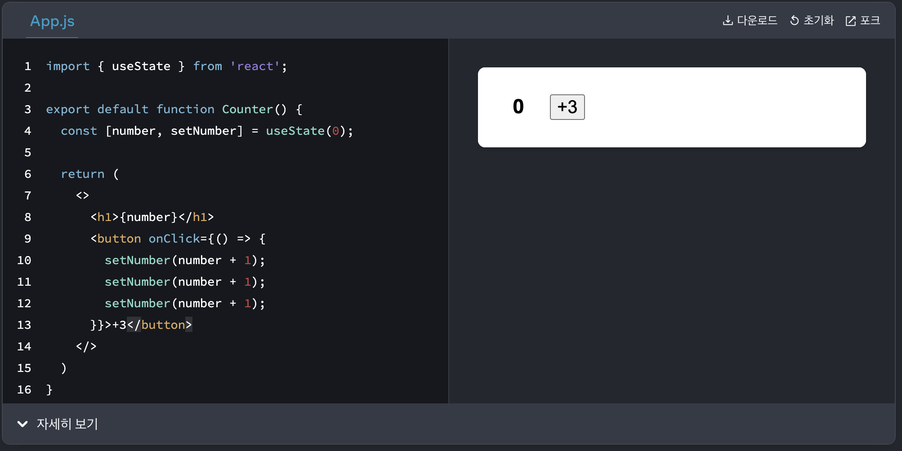

# 스코프
~~~
자바스크립트에서 스코프(Scope)는 변수, 함수, 객체가 접근 가능한 범위를 말합니다.
스코프(Scope)는 코드가 어디서 어떻게 실행될 것인지 결정합니다.
주로 렉시컬(정적)스코프와 동적 스코프로 나뉘는데, 자바스크립트는 렉시컬(정적) 스코프입니다.
렉시컬 스코프는 함수를 선언할 때의 위치에 따라 상위 스코프가 결정됩니다.
~~~

### 먼저 스코프에는 어떤게 있는지 보자
~~~
글로벌 스코프(Global Scope): 최상위에 선언됨. 어디서든 접근가능(전역)
함수 스코프(Function Scope): 함수 내에서 선언된 변수는 함수에서만 접근가능(private) (e.g.,var)
블록 스코프(Block Scope): 블록{} 영역 안에서만 유효. (e.g., ES6의 const, let)
렉시컬 스코핑(Lexical Scoping): 함수가 다른 함수 내부에 존재할 때, 내부함수는 외부함수의 자원을 가져다 쓸 수있음 ( 클로저는 렉시컬 스코프의 개념을 기반으로 작동 )
~~~

## 한번 더 스코프 정의를 보자
~~~
자바스크립트는 렉시컬(정적) 스코프입니다.
렉시컬 스코프는 함수를 선언할 때의 위치에 따라 상위 스코프가 결정됩니다.
~~~
---

### 그래서 this는 뭔데요? (진정하고 좀더 보자..)
~~~
this를 알기 위해서는 스코프와 실행컨택스트 사이의 관계를 알아야한다.

이전 글 동시성(Concurrency)에서 자바스크립트는 하나의 스레드로 한번에 한개의 작업만 할 수 있고,
이때 실행 컨택스트는 스크립트(또는 함수)가 실행되는 동안 필요한 모든 정보를 담고있는 환경을 만듭니다
실행 컨택스트가 만든 환경 중 현재 참조하는 객ㅍ체가 this에요.

실행 컨택스트 역할은 이전 글(Prototpe)의 스코프 체인을 타고 현재 실행중인 코드와 스코프에 접근해서 
함수 호출, 변수 할당, this 바인딩 등의 작업 정보를 담아 코드가 실행될 때 정확한 참조와 순서를 보장합니다.
~~~

---
## 실행 컨택스트
~~~
자바스크립트는 콜스택에 실행할 함수들을 모아 문맥(context)을 만든다.
실행 컨택스트는 콜스택 최상단의 실행할 코드에 제공할 환경 정보들을 모아놓은 '객체'이다.
(지금 내가 사용할 수 있는 변수들, 함수들 모음집이라고 생각)

구성요소: 변수 객체(Variable Object), 스코프(scope), this

실행 컨택스트에 담기는 정보
1. Variable Environment(변수 환경): 변수명과 현수 현재 값, 함수 명과 참조가 저장됨
2. Lexical Environment(어휘 환경): 변수, 함수 외에도 외부 스코프와 연결정보를 가짐 -> 이 정보는 스코프체인 형성에 사용됨
   -> Lexical Environment는 스코프체인과 함께 클로저를 구현하는데 사용됨
3. ThisBinding (this): 현재 실행 컨택스트에서 This 키워드가 바라봐야 할 대상 객체
~~~

## 실행 컨택스트가 하는 일(요약)
~~~
1. 선언된 변수와 함수를 스코프의 맨위로 끌어 올린다.
2. 외부 환경 정보 구성
3. this 값을 설정한다.
~~~

## 그래서 진짜로 this는?
~~~
현재 실행컨택스트의 객체를 참조하는 키워드
~~~

## this 는 호출방식에 따라 값이 달라져요 (코드로 이해해봅시다)
~~~javascript
// 1. 일반함수 호출과 메서드로서 호출
function log() {
   console.log(this);
}

log(); // 일반적인 함수 직접 호출 시 브라우저에서는 window, node에서는 global 전역객체를 가리킵니다.

// 2. 객체의 메소드로서 호출
const obj = {
   showLog: log
}

obj.showLog(); // 객체의 메소드로는 매소드를 호출한 객체인 obj를 가리킵니다.

// 3. 화살표함수 호출
const obj2 = {
   name: 'my name is gayoung',

   // 객체의 메소드
   generalFunc: function() {
      console.log(this.name);
   },

   // 화살표함수
   arrowFunc = () => {
      console.log(this.name);
   }
}

obj2.generalFunc(); // 객체의 메소드는 호출한 객체인 obj2의 name인 'my name is gayoung'출력
obj2.arrowFunc(); // 화살표 함수는 생성될 당시의 상위스코프 this를 기억. 여기서는 window 전역객체가됨. (전역객체의 name이 없을경우 undefined)

// 4. 생성자를 통한 함수 호출
class myClass {
   name = '';
   constructor(newName) {
      console.log(this); // new 키워드 사용 시 this는 새로생성된 객체 newClass 가리킴
      this.name = newName;
   }
}
const a = new myClass('gayoung');  
~~~

## this 퀴즈
~~~javascript
var myObject = {
   name: "gayoung",
   showName: function () {
      console.log(this);
   }
} 

var saveFunc = myObject.showName;

var anotherObject = {
   name: "kong",
   showName: myObject.showName
}

myObject.showName(); // this는 상위스코프인 myObject 객체가됨 (객체의 메소드로서 호출)

saveFunc(); // 일반함수로서 호출 window 객체가 됨

anotherObject.showName(); // anotherObject의 상위스코프인 anotherObject 객체를 가리킴 (객체의 메소드로서 호출)
~~~

## 클로저
~~~
함수 + 렉시컬 환경 = 클로저
함수가 생성될 때의 환경을 기억하는 기능
~~~
~~~
클로저는 함수가 정의될 때 Lexical Environment(어휘 환경)을 기억(스냅샷)해서 함수 내부에서 외부 변수에 접근할 수 있는 기능을 의미함.
1. 함수 안에 다른 함수가 있을 때, 내부 함수는 외부 함수의 변수에 접근할 수 있다.
2. 외부 함수가 종료된 이후에도 내부 함수는 외부 함수의 변수에 접근할 수 있다.
3. private 변수처럼 사용 가능
~~~
~~~JS
ex 1)
function outer() {
  let x = 10;

  // inner 함수가 선언되면서 외부함수에 대한 스코프체인을 보고 x 값을 가져다 사용
  function inner() {
    console.log(x);
  }

  return inner;
}

const closureFunction = outer(); // inner() 리턴함;
closureFunction(); // console.log(10);

ex 2)
// 클로저 함수 =
const createCounter = () => {
  let count = 0; // 비공개 변수

  // 리턴하면서 함수를 반환하는데 이 함수가 선언될 때 외부함수에 대한 스코프체인을 보고 count 값 가져다 씀 
  return () => {
    return ++count;
  }
}

const counter1 = createCounter();
console.log(counter1()); // 1
console.log(counter1()); // 2 

const counter2 = createCounter();
console.log(counter2()); // 1 (독립적인 상태를 유지)
console.log(counter1()); // 3 (counter1과 counter2는 서로 다른 클로저를 가짐)

~~~

~~~
화살표 함수의 this와 클로저는 상위스코프의 값을 가져다 쓴다는 점에서 잠시 헷갈릴뻔했으나,
클로저는 함수가 생성되면서 체인 스코프를 구성하는데, 스코프의 정보로 외부환경에 접근할 수 있는 기능이다. (외부함수의 지역변수에 접근가능)
화살표 함수의 this의 경우 대상이 this일 뿐인거임. (외부함수의 this에 접근이 가능)

~~~

## 내가 마주쳤던 클로저 예제1
~~~
리뉴얼 된 리액트 공식문서를 보고 공부하다가
+3 버튼을 누르면 number 가 어떻게 되는지 예상해보자
-> 답은 예상대로 1이다.
이유는 상위스코프의 number 변수를(값: 0) 각 setNumber가 3번 실행되어도 각각 setNumber(1); 을 실행할 뿐이다.
~~~

## 내가 마주쳤던 클로저 예제2
~~~
스크롤 애니메이션으로 300px 정도 올라왔을 때 스타일을 추가하여 화면에 보여줄 수 있도록 작업했는데
let 변수로 선언해놓고 정확하게 원하는 타이밍에 애니메이션이 잘 동작하여 넘어갔는데, 코드리뷰 때 눈에 확 들어왔다.
단순 정보성 페이지라 문제될 일은 없었지만, 복잡한 기능을 하는 페이지였다면 문제가 생겼을 것이다..ㅠㅠ
~~~
~~~JS
// 현재 섹션
const section = useRef(-1);

// 위치 값을 저장해놔요
const targetElementsRef = useRef([]);

useEffect(() => {
   const arrElements = document.getElementsByClassName("mileage-animation-section");

   // 맨 처음에 이렇게 썼다. 
   // let position = new Array(); // 여기가 이슈다....

   Array.prototype.map.call(arrElements, (e) => {
      targetElementsRef.current.push(e.getBoundingClientRect().top + 300 || 0)

      // 이렇게 써도 함수가 (e)=> {...} 함수가 생성될 때 외부함수에 대한 스코프체인을 보고
      // position 변수에 접근할 수 있었는데 별 문제 없어보일지라도, 의도하지 않은 코드기때문에 ref로 변경하였다..
      // position.push(e.getBoundingClientRect().top + 300 || 0);
   })

   window.addEventListener("scroll", calcPosition), {
     passive: true // 스크롤 이벤트를 더 부드럽게 처리하고 렌더링을 최적화하기 위해 사용
   }); 
   window.addEventListener("resize", calcPosition), {
     passive: true
   });
   window.addEventListener("beforeunload", initPosition);

   ()  => {
     window.removeEventListener("scroll", calcPosition);
     window.removeEventListener("resize", calcPosition);
     window.removeEventListener("beforeunload", initPosition);
     d.current = {
         section: 0
     }
   }
}, []);

   /**
      * 현재 섹션 비교하여 숨겨둔 섹션을 보여줘요
   */
   const calcPosition = () => {
      const e = section.current;
      const i  = window.scrollY;

      if ( targetElementsRef.current.length > e + 1 &&
            targetElementsRef.current[e + 1] <= window.innerHeight + i ) {
         r(e + 1);
         section.current += 1;
         j && j.setAttribute("data-scroll-header", 0 === i ? "false" : "true");
      }
   }

   /**
      * 위치 초기화
   */
   const initPosition = () => {
      window.scrollTo(0, 0);
   }
   ~~~

## 자바스크립트의 가비지 컬렉터(GC)
~~~
자바스크립트의 가비지컬렉터는 개발자가 커스텀할 수 없다.
(그만큼 어느정도의 성능은 보장되는 반면 최적화는 불가능하다)

자바스크립트의 가비지컬렉터는 마크 앤 스윕 방식으로 동작한다!
실행 컨택스트 상에 마크되지 않거나, 스코프상에 참조가 되지 않는 데이터들을(=활성화 되지 않은 데이터들) 순차적으로 정리한다는 의미다.

가비지 컬렉터가 대부분의 참조되지 않는 데이터들의 메모리 할당을 해제해버리지만,
개발자의 실수로 메모리에 불필요하게 남아있는 경우가 있다.
이걸 메모리릭(memory leck)이라고한다.
메모리 릭이 발생하면, 백화현상이 일어난다..ㅠㅠ (VoC로 많이 들었던 이야기다)

즉시에 해결하지 못하고 ...이후에 최적화를 하기위해 useCallback, useMemo를 공부하다 알게되었는데,
이유는 useMemo가 빠져있어서였다!!
도메인 별로 mobx store를 만들고 context에 바인딩하는 과정에서 매번 새로운 컨택스트가 생기면서 메모리릭이 발생한 것이였다.

전역변수 사용을 자제하고, 사용후에는 null 처리 해주고 (null의 의미는 의도적으로 사용하지 않는 값이다. GC가 잡아감!)
컴포넌트 언디마운트 될 때 타이머나 이벤트리스너 클린 잘해주고,
언디마운트 될 때 ref 변수들도 잘 초기화 해주는게 좋다.
~~~
