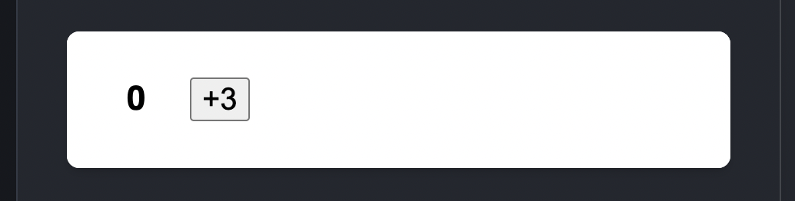

[2. 상호작용성 더하기]
~~~
2-1. 이벤트에 응답하기
2-2. State: 컴포넌트의 기억 저장소
2-3. 렌더링 그리고 컴포넌트
2-4. 소스코드로서의 state
2-5. State 업데이트 규칙
2-6. 겉값 state 업데이트하기
2-7. 바뀐 state 업데이트하기
~~~

## 2-1. 이벤트에 응답하기
~~~
이벤트 헨들러

특징)
1. 주로 컴포넌트 내부에 정의됨
2. handle 이란 이름 prefix가 붙음.
3. 즉시실행함수로 선언하지 않도록 주의
4. 깡통함수는 생략가능
ex. onClick={() => handleClick()}  -> onClick={handleClick}
onChange={(e) => handleChange(e)} -> onChahne={handleChange} // e 파라미터 하나인 경우 생략 가능

랜더 함수 안에서 인라인으로 사용되는 경우가 많은데,
개인적으로는 랜더함수 안에 로직이 있는 것을 선호하지 않음. (가독성 떨어짐)
또한 코드 재사용성과 최적화 측면에서도 함수는 랜더함수 바깥으로 올리는 것을 선호함

~~~

~~~jsx
/* html은 항상 children 이라는 이름으로 받아올 수 있다. 순서 상관없다. (나머지 속성을 네이밍 기반으로 찾아오기 때문) */
function Button({ onClick, children }) {
  return (
    <button onClick={onClick}>
      {children}
    </button>
  );
}

function PlayButton({ movieName }) {
  function handlePlayClick() {
    alert(`Playing ${movieName}!`);
  }

  return (
      {/* onClick 이벤트와 html 전달 */}
    <Button onClick={handlePlayClick}>
      Play "{movieName}"
    </Button>
  );
}
~~~

### 이벤트헨들러 네이밍 prefix
~~~
생각해보면 필자는 컨벤션에 맞춰 적당히 명명을 해왔던 것 같다.
이번 기회에 prefix 규칙을 알고 정확히 사용하자.

기본적으로는 컴포넌트 내부에서 사용되는 이벤트헨들러에 handle 접두사를 붙이는게 맞다.
(3음절 안넘어가게 의미를 잘 부여하자.)

on 접두사는 외부(부모) 컴포넌트로부터 받은 props 이벤트헨들러에 사용된다.
(하지만 기본적으로 사용되는 이름으로 사용하지 말자. 아래와같은 상황이 발생된다.)
~~~

~~~jsx

const ChildComponent = (props) => {
// const ChildComponent = ({onClick, ...props}) => { 기본 네이밍을 쓴다면 반드시 이렇게 비구조할당해서 예방을 한다
    return (
        

            {/* props에 onClick 기본이름으로 명명된 이벤트가 있어 커스텀 버튼에서도 그대로 onClick으로 사용될 여지 있음 */}
            <CustomButton {...props} />

            <button onClick={props.onClick} />
        

    )
}

~~~

## 이벤트 전파
~~~
onScroll을 제외한 React 내의 모든 이벤트는 전파된다.

e.stopPropagation()으로 버블링을 막아줄 수 있다.

stopPropagation로 이벤트를 중단시켜도 로그를 확인하기위해 부모쪽에 capture를 추가해주면 모든 이벤트를 추적할 수 있다.
(나중을 위해 알아두면 좋을 것 같다)

e.preventDefault()는 브라우저 기본동작을 막아준다. 주로 폼태그 내부 버튼 클릭이벤트에서 전송을 막기위해 사용된다/
~~~

## 2-2. State: 컴포넌트의 기억 저장소

~~~
State는 리액트의 라이프사이클과 같이 움직이는 화면에 움직이는 값 입니다.
16.3 이전 버전에서는 생성자 함수를 통해 생성 후 setState를 통해 업데이트. 
16.3 이후 버전에서는 훅을 통해 useState로 업데이트합니다.

동일 컴포넌트를 여러번 호출하면, 같은 이름의 State라도 전혀 관련없이 동작합니다.
리액트는 어떤 State가 변경되었는지 어떻게 알 수 있을까요?
-> 호출되는 순서는 항상 동일하기에, 호출 순서에 의지한다.
또한 리엔트 엔진은 컴포넌트마다 state 배열 카운터를 가지고({0: 0, 1: ƒ setState(nextState)}) 스테이트가 변경될 때마다 카운트를 올린다!
(자세한 내용은 여기에: https://medium.com/@ryardley/react-hooks-not-magic-just-arrays-cd4f1857236e)
~~~

2-3. 렌더링 그리고 커밋

~~~
1. 렌더링 트리거 (초기렌더링, state 변경 시 발생)
2. 렌더링: 초기에는 Root 컴포넌트 호출, 이후에는 state 변경으로 트리거를 만들어낸 컴포넌트를 호출
3. 리액트가 DOM을 변경사항에 커밋: (appendChild(), 이후에는 변경사항만 커밋)
~~~

## 컴포넌트 최적화
~~~
만약 부모컴포넌트의 state 변경사항이 생긴다면, 
트리거가 발생하기 때문에 render 함수가 실행되고 자식컴포넌트들은 다시 호출된다.(렌더링 된다)
그렇다면 부모 컴포넌트가 렌더링되면 자식컴포넌트는 "반드시" 렌더링 된다고 할 수 있을까?

결론부터 말하면 부모컴포넌트에서 자식으로 넘기는 props가 변경되지 않거나,
memo로 감싸진경우 리액트가 어느정도 불필요한 렌더링을 방지하여 최적화를 해준다.
(성급한 최적화는 지양해야한다, 필요할 때 적절히 하는게 중요하다)
~~~

[링크가 잘못되어있어 제보도 하나 해봤다](https://github.com/reactjs/react.dev/issues/6603)

## 2-4. 스냅샷으로서 state
~~~
리액트에서는 state가 변화하면, 변화된 State를 가지고 그 당시의 props, 이벤트 헨들러들을 모아 
스냅샷 된 JSX를 반환합니다
~~~

~~~jsx
import { useState } from 'react';

export default function Counter() {
  const [number, setNumber] = useState(0);

  return (
    <>
      <h1>{number}</h1>
      <button onClick={() => {
        setNumber(number + 1);
        setNumber(number + 1);
        setNumber(number + 1);
      }}>+3</button>
    </>
  )
}
~~~

~~~
이 이미지 속 버튼을 클릭하면 +3이아닌 +1로 동작한다!

이유는 클로저와 배치 때문이다. 

일단 클로저는 setNumber 함수 정의할 때 외부변수인 number, setNumber에 접근할 수 있어서, 
setNumber(number => return number + 1) 로 동작할때 number가 0이기 때문이다.

setState는 비동기적으로 업데이트되어서 setNumber가 "3번 발생하지만"
number에 반영되기 전에 setNumber(0 => return 0 + 1) 이 3번 일어나게 되는것과 같다.
1 -> 2 -> 3 빠르게 반영되는게 아닌데도 말이다
~~~

~~~jsx
// 이렇게 바꿔주면 의도한 대로 잘 동작한다
<h1>{number}</h1>
<button onClick={() => {
  setNumber((prev) => prev + 1);
  setNumber((prev) => prev + 1);
  setNumber((prev) => prev + 1);
}}>+3</button>
~~~

~~~
react 18 버전에서 
createRoot API가 도입되어 동시성 모드(concurrent mode) 기능으로 state변경이 잦을 때 배치업데이트하게 할 수 있다는데,
단순 18버전 리액트에서 동시실행 -> 동일한결과
setNumber((prev) => prev + 1);를 사용한 상태관리 매커니즘은 버전에 관계없이 동일하게 적용됨 (해결방법..)

그렇다면 토끼굴을 조금 더 파서,
React 18의 동시성 모드를 잘 활용하는 예제로는, 사용자 입력 처리나 데이터 패칭 시 상태 업데이트를 최적화하는 경우가 있음
동시성 모드에서는 startTransition 같은 API를 사용하여 우선 순위가 낮은 상태 업데이트를 처리할 수 있습니다. 
(useTranstition)
~~~

~~~jsx
// input value 입력 -> upDateData 이벤트 발생 -> startTransition가 setData를 비동기적으로 호출함으로써 
// input 입력필드 반응성 안떨어뜨리면서도 비동기적으로 data를 업데이트해서 
// loading... 또는 (업데이트된)스냅샷된 DataComponent 보여줌
import { useState, useTransition } from 'react';

export default function SearchComponent() {
  const [input, setInput] = useState('');
  const [data, setData] = useState([]);
  const [isPending, startTransition] = useTransition();

  const updateData = (newInput) => {
    // 가정: fetchData는 비동기 함수이며, newInput에 기반한 데이터를 가져옴
    fetchData(newInput).then(newData => {
      startTransition(() => {
        setData(newData);
      });
    });
  };

  return (
    <>
      <input
        type="text"
        value={input}
        onChange={(e) => {
          setInput(e.target.value);
          updateData(e.target.value);
        }}
      />
      {isPending ? Loading... : <DataComponent data={data} />}
    </>
  );
}

~~~

## 2-5. State 업데이트 큐
~~~
React는 state 업데이트를 하기 전에 이벤트 핸들러의 모든 코드가 실행될 때까지 기다립니다. 
= 리액트는 배칭(batching)을 통해 최종 연산 결과만 화면에 반영함으로서 사용성 좋음

모든 코드가 실행될 때까지 기다린다는데 왜 빨라? -> 실제 돔의 값과 속성을 추상화시켜서 만든 가상돔(virtual dom)
가상돔끼리 비교하여 랜더트리 만들기 전 (diff 알고리즘 수행) -> 리플로우 리페인트 줄어듬
~~~
[자세한 내용은 여기](../Web/Browser_Architecture_and_Functionality_Understanding.md)

### 2-5 다음 렌더링 전에 동일한 state 변수를 여러 번 업데이트하기
~~~
반복되는 내용, 동일한 state변수 업데이트 시 이전 값을 인자로 넘겨준다.

setNumber((prev) => prev + 1);
~~~

~~~jsx
  setNumber(number + 5); // 0 + 5 => 5로 대체하기
  setNumber(n => n + 1); // return 이전값 + 1 

// 결과는 6 (setState에 이전 값을 주지 않는다면 replace 의미로 바라보면 이해가 쉽다)
~~~

~~~
setState (업데이트함수)는 순수함수여야한다
(= 업데이터 함수 내부에서 state를 변경하거나 다른 사이드 이팩트를 실행하려고 하면 안된다.)
~~~
## 2-6. 객체 state 업데이트하기
~~~
리액트에서 객체는 직접 수정하면 안되고, 복사본을 만들거나 새로운 객체를 만들어 만든 값으로 업데이트해야합니다. (=불변성 유지, JS도 동일)
이유는 자바스크립트 객체는 mutable 하기 때문인데, 모던자바스크립트 딥다이브 스터디를 하고 예상 질문지를 뽑다 이런 질문을 발견했다.

"객체를 할당한 변수는 재할당 없이 객체를 직접 변경할 수 있습니다. 이때 값을 변경한 경우 객체를 할당한 변수의 참조값은 변경되지 않습니다. 그러면 왜 자바스크립트는 불변성을 유지하지 않는 걸까요?"
-> (결론: 할당 된 값에 따라 타입이 정해지는 동적인 언이인 자바스크립트는 객채의 경우 메모리를 효율적으로 사용하기 위해 원시값 처럼 매번 새로운 메모리에 할당 되는 것이 아니라 현재 메모리를 수정하게끔 설계되어있다)
-> 사실 나는 언어는 만든사람 마음이라고 생각해서, 객체를 왜 가변적으로 만들었을까 생각해본적이 없는데 여기까지 깊게 생각해보는 습관 너무 좋은 것 같다.
~~~

~~~jsx
// in javascript
let oXY = {
  x: 0
  y: 0
};
oXY.x = 10; // ok, but i dont like :-( 사실 객체를 직접 수정하는거 자체를 선호하지 않는다(항상 불변하게 짜는 스타일 선호)

// in react
const [objectXY, setObjectXY] = useState({x: 0, y: 0});
objectXY.x = 10; // ok but react compoennt didnt notice the state change
~~~

###  지역변경
~~~jsx
// 컴포넌트가 position state 변경 못알아챔
position.x = e.clientX;
position.y = e.clientY;

// 지역변경(local mutation) - 이 방법을 지역 변경이라 하는구나..
// 방금 만든 nextPosition 은 어디에도 참조하는 곳이 없으므로 안전함!
const nextPosition = {};
nextPosition.x = e.clientX;
nextPosition.y = e.clientY;
setPosition(nextPosition);

// 이렇게 쓸 수 있어용
setPosition({
  x: e.clientX,
  y: e.clientY
});
~~~

###  전개문법으로 객체 복사하기
~~~jsx
// 객체에서 일부 변경하고 싶을때는 spread연산자 사용하기
setPerson({
      ...person, // person도 스냅샷 된 값이다.(변경되지 않을값이니 상관없다.)
      firstName: e.target.value
    });

// 만약 또 setState를 동시에 여러번 발생시켜야한다면? 아래와 같이 쓴다.(업데이트되어야 하는 값은 이전값 꼭 넣어주자)
//  (객체는 mutable 할지라도 setState는 배치로 돌아감을 잊지말자)
setNumber((prev) => ({ ...number, y: prev.y + 1 }));
setNumber((prev) => ({ ...number, y: prev.y + 1 }));
setNumber((prev) => ({ ...number, y: prev.y + 1 }));

~~~

~~~
객체를 다룰땐 immer와 같은 라이브러리 사용 권장(편함)
~~~
[라이브러리비교](../JS/Immutability.md)

### 공식문석에서 제공하는 객체를 불변성을 유지해야하는 이유
~~~
1. 디버깅: 언제 state가 변경되었는지 파악 용이

2. 최적화: 불변성 유지할 경우 객체가 변경되었는지 찾는게 빨라서 최적화에 유리함

3.새로운 기능: 불변하게 코드 안짜면 새로운 react api 나와도 호환 어려움

4. 요구사항 변화: CRUD등 

5. 더 간단한 구현: 리액트는 변경에 의존하지 않기 때문에 객체로 뭔가 특별한 것을 할 필요가 없습니다. (한글인데도 뭔소린지 모르겠다.)
~~~

## 2-7. 배열 state 업데이트하기
~~~
배열도 객체다. 매번 새로운 객체를 만들어서 업데이트 해줘야한다.
(슬라이스 스플라이스 맨날 헷갈린다)
~~~

||비선호(기존 배열 변경)|선호(새 배열 반환)|
|---|:---|---:|
|추가|push, unshift|concat, 전개(spread)...연산자|
|제거|pop, shift, splice|filter, slice|
|추가|splice, 할당|map|
|추가|reverse, sort|배열 복사(deepcopy임) 후 정렬|

~~~
배열을 복사할 때 stringfy(), deepcopy, 반복문(for등) 많은 방법이 있는데 어떤걸 선호하는지? 선호하는 이유는 무엇인지?
-> stringfy는 날짜같은 타입에서 형변환 오류 날 수있어서 비선호
성능을 최적화 해야하는 부분이 아니라면 deepcopy 선호함. 

이유는 바퀴의 재발명.. 협업등의 요소로 매번 코드를 분석해야하기때문
~~~

