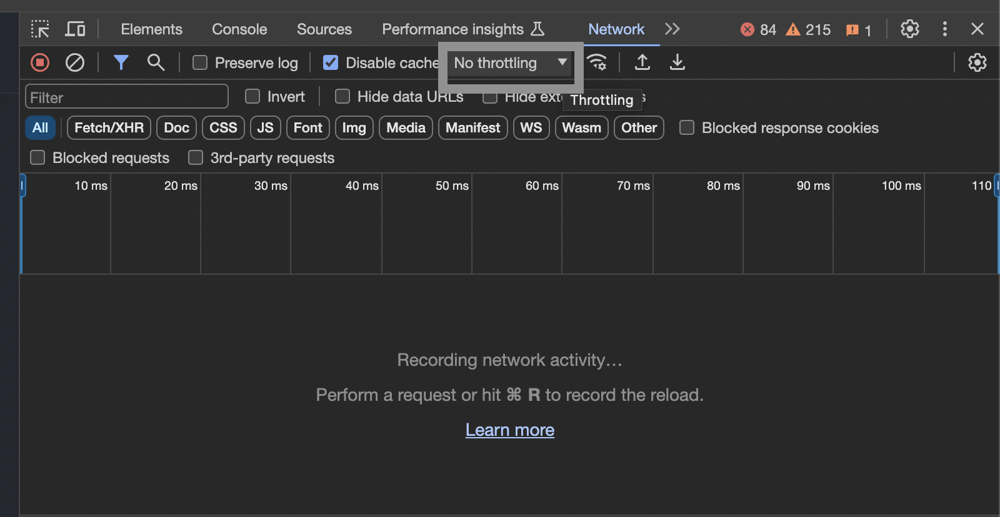

~~~
4-1. Ref로 돔 참조하기
4-2. Ref로 값 조작하기
4-2. Effect로 동기화하기
4-3. Effect가 필요하지 않은 경우
4-4. React Effect의 생명주기
4-5. Effect에서 이벤트 분리하기
4-6. Effect 의존성 제거하기
4-7. 커스텀 Hook으로 로직 재사용하기
~~~

# Ref로 돔 참조하기
~~~
생명주기에 걸쳐 값을 유지하지만, 렌더링은 안 일어나게 하고싶을 때는 ref를 사용합니다.
useState와 useRef는 생명주기와 별개로 관리할 수 있는 값 입니다.
렌더링여부에 따라 useState, useRef를 구분해서 사용합니다.
~~~

~~~js
// 이런식으로 사용합니다.
const variable = useRef(0);

variable.current = 10;
~~~

~~~
current 프로퍼티를 통해 수정이 가능합니다.
current는 이 식별자(여기서는 변수)가 가리키는 값을 참조하고있습니다.
참조를 통해 리액트 생명주기에서 벗어나서 관리가 가능합니다.

공식홈페이지 예제에서는 스탑워치(setInterval 을 사용)를 예시로들어
Stop을 구현하기위해 해당 이벤트 timeout ID를 저장할 변수가 필요하다는 예시를 들고있습니다.
~~~

|useRef|useState|
|---|:---|
|state를 바꿔도 리렌더 되지 않습니다.|state를 바꾸면 리렌더 됩니다.|
|Mutable-렌더링 프로세스 외부에서 current 값을 수정 및 업데이트|”Immutable”—state 를 수정하기 위해서는 state 설정 함수를 반드시 사용하여 리렌더 대기열|
|렌더링 중에는 current 값을 읽거나 쓰면 안 됩니다.|언제든지 읽고쓸 수 있지만 snapshot이 존재합니다.|

~~~
위 예제처럼 아래와 같은 상황에서 ref를 사용합니다.
Timeout id를 저장해야할 때
dom 엘리먼트 저장과 조작 (provider 처럼 사용)
JSX를 계산하는 데 필요하지 않은 다른 객체 저장 (저는 이경우에 가장 많이 사용합니다.)
~~~

~~~js
// ref의 동작은 이렇게 되어있다는데. 실제로 이렇게 되어있진 않고 단순화 된것임
function useRef(initialValue) {
  const [ref, unused] = useState({ current: initialValue });
  return ref;
}
~~~

# Ref로 돔 조작하기
~~~
react는 대부분의 경우 state의 변경으로 돔을 리액트에서 업데이트해주기 때문에
돔을 직접 조작할 일이 별로 없습니다.

바닐라js를 사용하면 돔 조작할일이 굉장히 많습니다.
그래서, Ref로 돔 조작하는 방법은 바닐라로 조작하는 방법과 아주 조금 다릅니다.
~~~

~~~jsx
// undefined 는 값이 할당되기 전에 쓰이는 값으로 
// 여기에서는 의도적으로 값이 없음을 나타내기위해 null을 쓰는것이 바람직합니다.
const myRef = useRef(null); 

// 예를 들어 이렇게 브라우저 API를 사용할 수 있습니다
inputRef.current.focus();
~~~
~~~
공식문서 예제 중 scrollIntoView를 알게되었습니다.
항상 scrollTo만 사용했는데 스크롤 이벤트 기능에 활용할 수 있을까 싶어
두개를 비교해봤습니다.
~~~

| scrollTo                         | scrollIntoView를                                                                                                                                                        |
|----------------------------------|:-----------------------------------------------------------------------------------------------------------------------------------------------------------------------|
| 절대값으로 x,y 스크롤 위치를 해당 좌표로 이동시킵니다. | 해당 dom 요소가 사용자 화면(뷰포인트)상에 위치하도록 부모 컨테이너를 이동시킵니다.                                                                                                                       |
| 이동하려는 위치값을 정확히 알아야합니다(계산해야합니다)   | 상대적 위치를 기반으로 스크롤합니다. 가운데로 이동시키는건 아니고 viewPort 안에 이미 완전히 존재한다면 발생하지 않을 수 있습니다.  block: 요소가 뷰포트에 어떻게 위치할지 결정합니다. block: "start", "center", "end", "nearest" 값을 가질 수 있습니다.|

~~~
// ref로 리스트 dom 요소 가져오기
useRef를 여러번 사용해야하는 경우라면 render()함수 아래서 map으로 반복문 돌리지말고,
부모 요소에 ref를 넣어 가져온 후, 
querySelectorAll과 같은 DOM 조작 메서드로 돔 요소들을 추출해서 사용하는 것을 권장합니다.

~~~
~~~JSX
// 하지만 리액트가 관리하는 (state로 연결된) 돔 노드는 ref로 변경하면 오류가 발생합니다.
 

      {/* 2번 */}
      <button
        onClick={() => {
          setShow(!show);
        }}>
        Toggle with setState
      </button>
      {/* 1번 */}
      <button
        onClick={() => {
          ref.current.remove();
        }}>
        Remove from the DOM
      </button>
      {show && 
Hello world
}
    

~~~

~~~
다른 컴포넌트의 ref는 가져다 쓸 수 없습니다.
~~~
~~~jsx
// before
function MyInput(props) {
  return <input {...props} />;
}

export default function MyForm() {
  const inputRef = useRef(null);

  function handleClick() {...}

  return (
    <>
      <MyInput ref={inputRef} />
      <button onClick={handleClick}>Focus</button>
    </>
  );
}
~~~
~~~js
// after
const MyInput = forwardRef((props, ref) => {
  return <input {...props} ref={ref} />;
});

export default function Form() {
  const inputRef = useRef(null);

  function handleClick() {...}

  return (
    <>
      <MyInput ref={inputRef} />
      <button onClick={handleClick}>Focus</button>
    </>
  );
}
~~~
~~~
forwardRef로 다른 컴포넌트에 ref 값을 직접 넘겨본 경험이 있습니다.
가독성이그렇게 좋진 않았습니다. 그래서 꼭 필요할때만 쓰자고 생각했습니다.

useImperativeHandle 로 forwardRef 에서 일부만 속성을 노출할 수 있도록 설정할 수 있습니다.
~~~
~~~
리액트의 모든 갱신은 돔을 불러오는 1.렌더링단계, 변경사항을 돔에 반영하는 2. 커밋단계로 나눌 수 있습니다.

ref로 돔을 조작할 때, 리액트는 처음에 렌더링 전이므로 ref변수에 null을 부여하고
커밋 단게에서 돔 요소를 ref 변수에 할당합니다.
주로 이벤트 헨들러에서 ref를 조작합니다.
~~~
~~~
flushSync로 state 변경을 동적으로 플러시하기

(처음 보는 기능이라, 그대로 옮깁니다)

submit()을 하면, 이벤트 핸들러를 통해 state리스트에 추가하고, scrolltoView()를 통해 스크롤을 이동시킵니다.
// 원하는대로 동작하지 않음
setTodos([ ...todos, newTodo]);
listRef.current.lastChild.scrollIntoView();

그런데, setState는 비동기적으로 일어나므로, 스크롤 이동이 한 아이템 적게 일어납니다.

setState를 flushSync로 감싸면 동기적으로 setStaet를 실행할 수 있게됩니다.
// 원하는대로 동작함
flushSync(() => {
  setTodos([ ...todos, newTodo]);
});
listRef.current.lastChild.scrollIntoView();
~~~
---

# Effect로 동기화하기
~~~
컴포넌트 내부의 로직은 2가지로 나눌 수 있습니다.
1. 렌더링코드 : JSX로 이루어져 순수한 HTML 표현 로직이여야합니다.
2. 이벤트헨들러: 사용자 동작으로 이루어진 이벤트, 혹은 부수효과를 말합니다.

단, 사용자 동작과 관련없는 이벤트들이 있습니다.
특정 이벤트가 아닌 렌더링에 의해 직접 발생하는 이벤트입니다.
e.g., 화면이 나타나면 채팅창을 띄워야하는 경우가 있습니다.

렌더링 변경 시점에서는 커밋 이후가 됩니다. 이를 Effect라고합니다.
이 시점에 데이터를 패칭해오기 유용해보입니다.
~~~

~~~
리액트가 필요 없는 케이스는 다음 장에서 학습합니다.
무작정 useEffect를 추가하지 말라는 의미입니다.
~~~

~~~
useEffect를 정의하는 방법은 아래 단계를 따릅니다.
1. Effect선언 : 기본적으로 useEffect는 렌더링 이후에 실행됩니다.
2. 의존성 지정 : 모든 렌더링마다 useEffect가 발생하는 것이 아닌,
 특정 사용자 이벤트에 의해 발생할 수 있도록 의존성을 지정합니다.
3. 필요한 경우 클린업: removeEventListener, off, fetch 취소(혹은 무시) 등이 있습니다.
~~~

~~~js
// 그냥 ref를 사용한다면, 위의 ref 잘못된 사용방법처럼
// 렌더링 중에 ref dom요소를 수정하기 때문에 우리는 돔 요소 제어에 어려움을 겪을 것 입니다.
// 혹은 ref 자체가 의미 없을지도요.
// 이를 useEffect 함수로 감싸준다면, 렌더링 이후에 ref로 돔 요소를 제어하기 때문에 오류를 피해갈 수 있습니다.
~~~

~~~
의존성 배열에는 여러가지 조건이 들어갈 수 있습니다.
(useEffect 내부에서 사용하는 변수를 의존성 배열에 넣지 않으면 린트 오류가 발생합니다.
린트를 잘 써야겠다는 생각이 또 드는 부분입니다)

일단 의존성 배열에 조건이 한개라도 변경되면 useEffect가 실행됩니다.
(반대로 말하면 의존성 배열 조건이 모두 다 변경되지 않아야만 useEffect를 다시 실행하지 않습니다)
만약 해당 조건에 변경되고 싶지 않다면,
useEffect 내부로직을 수정하여 해당 변수를 사용하지 않도록 조정하거나,
조건을 비교해서 분기처리를 통해 해당 로직을 by pass하도록 만들어줘야합니다.
~~~

~~~js
// 공식문서가 요약을 참 잘해놨습니다.

useEffect(() => {
  // 모든 렌더링 후에 실행됩니다
});

useEffect(() => {
  // 마운트될 때만 실행됩니다 (컴포넌트가 나타날 때)
}, []);

useEffect(() => {
 // 마운트될 때 실행되며, *또한* 렌더링 이후에 a 또는 b 중 하나라도 변경된 경우에도 실행됩니다
}, [a, b]);
~~~

~~~
* 중요
왜 useEffect에서 ref변수는 의존성배열에 넣지 않아도되나요?
일단 넣지 않아도됩니다. 이유는 ref변수가 '안정된 식별성(stable identity)'을 가지기 때문입니다.
리액트 생명주기에서 벗어났다고도 보는데, 언제나 참조하면 같은 객체를 반환하기 때문과 같은 말입니다.

추가로 포함해도 문제없습니다. (만 안그래도 복잡해질 수 있는 조건에 가독성을 해칠 수 있기에 비선호합니다)
~~~

~~~

~~~
~~~
그리고 이벤트리스너나, 소켓의 경우 잘 취소해줘야합니다.
return구문 안에서 취소하면됩니다.

이전 회사에서 가끔 메모리릭(으로 인한 백화현상)이 나는 경우가 발생했는데
나중에 알게되었지만, 이펙트 밖에서 선언된 함수인데 전역스토어 의존성 주입하는 부분의 데이터가 의존성배열에 빠져있어서, 
클린업이 제대로 안되서 메모리릭이 발생했습니다.
(밖에서 선언된 함수를 Effect안으로 넣거나, 의존성배열에 잘 추가하면됩니다)

클린업을 잘 해줘야합니다!
~~~
~~~js
번외로 클린업은 Ref 변수들도 클린업을 잘 해줘야합니다. (초기값으로)
이유는 성능때문입니다. 

interface userList {
 // 매우 복잡한 타입
}

const data = useRef<null | userList>(null);

useEffect(() => { 
   // 매우복잡한 로직

   // 여기가 초기화!
   () => data.current = null;
, []};

직접적으로 공식문서에서 ref 변수를 초기화함으로써 GC를 일어나게한다는 말은 없지만.(메모리 할당 해제)
하지만, 불필요한 참조를 제거함으로써 GC가 수행될 가능성을 높일 수 있습니다.
~~~
### api 더블클릭 방지 (2번 호출 방지)
~~~ js
// post 요청은 가끔 보안, 기능상의 이유로 2번 신청을 프론트에서 1차적으로 걸러줘야합니다. (완벽하게 하려면 BE에서도 중복신청 방지가 들어가야겠지만요.)
const isDoubleClick = useRef(false);

const handleClick = () => {
  // 실행중이면 리턴
  if (isDoubleClick.current) {
    return;
  }
  
  isDoubleClick.current = true;

  fetch('api/url')
    .then(() => {
      // 로직들..
    })
    .finally(() => {
      // 여기서 해제
      isDoubleClick.current = false;
    });
}

<button onClick={handleClick}>클릭!</button>

~~~

~~~
effect 안에서 데이터 패칭하는것에 대해 4가지 불편한 점이 있다고 공식문서에서 설명합니다.
ssr(html을 서버에서 그림 + 클라이언트에서 js다운받아서 데이터 로드)
csr(빈 html + js + css 클라이언트가 가져와서 html 그리고 데이터도 로드)

1. ssr(서버에서 html 내려주고 사용자가 js파일 다운로드해서 데이터를 로드해야함)에서 effect는 동작하지않습니다.
2. 네트워크 폭포를 만듭니다 : 부모 -> 자식 으로 렌더링되면서 부모가 렌더링이 일어나야 자식컴포넌트 시작되면서 그리는것 + 패칭 병렬로 할 수 있는데 무조건 탑다운으로 진행하게됨 (ssr에서는 미리 html그리기에 일부 해소됨)
3. 매번 해당 컴포넌트를 패칭해야함: 컴포넌트가 언마운트되면 항상 다시그려야함. (특히 csr에서 추가적인 혹은 불필요한 패칭 발생)

이런 경우 해결방법으로 패칭 매커니즘을 제공하는 프로덕션 수준 프레임워크(개츠비, 넥스트, 리믹스 등)를 쓰거나
React query, swr, react router +6.4를 적용을 고려할 수 있습니다.
Effect를 내부적으로 사용하면서 요청 중복을 제거하고 
응답을 캐시하고 네트워크 폭포를 피하는 로직을 추가할 것입니다. 
(데이터를 사전에 로드하거나 데이터 요구 사항을 라우트)
~~~

~~~js
// 컴포넌트 외부에 쓸 경우, 리액트 컴포넌트 생명주기에 들어가지 않고
// 애플리케이션 시작 시(새로고침 누르지 않는한) 1번만 실행됨을 보장합니다. (몰랐습니다..)

if (typeof window !== 'undefined') { // 브라우저에서 실행 중인지 확인합니다.
  checkAuthToken();
  loadDataFromLocalStorage();
}

function App() {
  // ...
}
~~~

# Effect가 필요하지 않은 경우
~~~
Effect 역시 생명주기에서 벗어난 '탈출구'중 하나입니다.

불필요한 Effect가 있는 경우를 찾아보고 제거함으로써 가독성, 속도향상, 에러가 발생할 확률을 줄일 수 있습니다.
(여기부터는 머리속에서 Effect의 실행순서를 그림으로 그려야합니다.)
~~~

## 불필요한 Effect를 제거하는 방법
~~~
렌더링 전에 데이터를 정제하고 싶을때 가능하면 Effect보다 컴포넌트 최상단에서 실행하는것을 권장합니다.
예제는 아래 비용이 많이드는 계산 캐싱하기에서 나옵니다.
이유는 Effect 내에서 setState 하게되면 결국 다시 컴포넌트 함수가 계산을 다시하여 라이프사이클이 돌아가기 때문입니다.

사용자 동작(e.g., 필터 클릭) 으로 발생한 이벤트는 setState를 통해 업데이트 할 수 있습니다.
굳이 State 변경 이후에 실행되는 Effect는 필요하지 않습니다.
~~~

### props 또는 state에 따라 state 업데이트하기 
~~~js
// 기존 props나 state에서 계산할 수 있는 것이 있으면, 그것을 state에 넣지 마세요. 대신, 렌더링 중에 계산하게 하세요.
const [firstName, setFirstName] = useState('');
const [lastName, setLastName] = useState('');

// ✅ good
const fullName = firstName + lastName; 

// 🔴 bad
const [fullName, setFullName] = useState('');
useEffect(() => {
  setFullName(firstName + ' ' + lastName);
}, [firstName, lastName]);
~~~

### 비용이 많이드는 계산 캐싱하기
~~~js
// getFilteredTodos가 비용이 많이 드는 계산이라는 가정
function TodoList({ todos, filter }) {
  const [newTodo, setNewTodo] = useState('');

  // 🔴 bad - 중복 state, 불필요한 계산
  const [visibleTodos, setVisibleTodos] = useState([]);
  useEffect(() => {
    setVisibleTodos(getFilteredTodos(todos, filter));
  }, [todos, filter]);

  // ✅ good 컴포넌트 렌더링마다 실행됨
  const visibleTodos = getFilteredTodos(todos, filter);

  // ✅✅ best - todos, filter가 바뀌지 않는한 실행 안됨
  const visibleTodos = useMemo(() => getFilteredTodos(todos, filter), [todos, filter]);
}
~~~

### 어떤 계산이 비싼 계산인지 어떻게알아요?
~~~js
//  1. 콘솔로 타임체크
console.time('filter array');
console.timeEnd('filter array');

// 2 인위적인 속도 저하로 성능
~~~

### prop 변경 시 모든 state 초기화 
~~~js
// 프로필 A -> 프로필 B 코멘트가 초기화 안되는 문제 

// 🔴 bad: Effect에서 prop 변경 시 state 초기화
// 다른 프로필로 옮길 때 마다 state 를 초기화시키고 리액트 렌더링을 다시함
export default function ProfilePage({ userId }) {
  const [comment, setComment] = useState('');

  useEffect(() => {
    setComment('');
  }, [userId]);
  // ...
}

// ✅ good - key를 통해 프로필마다 다른 컴포넌트임을 인식하게 함
export default function ProfilePage({ userId }) {
  return (
    <Profile
      userId={userId}
      key={userId}
    />
  );
}

function Profile({ userId }) {
  // good: 이 state 및 아래의 다른 state는 key 변경 시 자동으로 재설정됩니다.
  // 초기화가 필요 없어짐
  const [comment, setComment] = useState('');
  // ...
}
~~~

###  props 변경 시 일부 state 만변경
~~~js 
function List({ items }) {
  const [isReverse, setIsReverse] = useState(false);
  const [selection, setSelection] = useState(null);

  // 🔴 bad: Effect에서 prop 변경 시 마다 state 조정하기
  useEffect(() => {
    setSelection(null);
  }, [items]);
  // ...

  // good
  const prevItems = useRef(false); // 공홈에 굳이 state로?
  if (items !== prevItems.current) {
    prevItems.cuurent = items;
    setSelection(null);
  }

  // best : 렌더링 중에 모든 것을 계산
  const selection = items.find(item => item.id === selectedId) ?? null;
}
~~~

### 이벤트 공유
~~~
Effect가 꼭 필요한게 아니라면, 그냥 함수/이벤트로 useEffect 대체가 가능함.
컴포넌트가 사용자에게 표시되었기 때문에 실행되어야 하는 코드에만 Effect를 사용
~~~
~~~js
function Form() {
  const [firstName, setFirstName] = useState('');
  const [lastName, setLastName] = useState('');

  // ✅ good: 컴포넌트가 표시되었으므로 이 로직이 실행됩니다. (mount 실행)
  useEffect(() => {
    post('/analytics/event', { eventName: 'visit_form' });
  }, []);

// 🔴 피하세요: Effect 내부의 이벤트별 로직 - 불필요한 상태값, useEffect
  const [jsonToSubmit, setJsonToSubmit] = useState(null);
  useEffect(() => {
    if (jsonToSubmit !== null) {
      post('/api/register', jsonToSubmit);
    }
  }, [jsonToSubmit]);
  
  function handleSubmit(e) {
    e.preventDefault();
    // ✅ good: 이벤트별 로직은 이벤트 핸들러에 있습니다. (사용자 이벤트는 해당경우 Effect 불필요)
    post('/api/register', { firstName, lastName });
  }
  // ...
}
~~~

### 연쇄계산 
~~~js
A state 변경 시 -> Effect에서 setState로 B 도 변경 -> Effect에서 setState로 C 도 변경
매 변경 마다 state를 바꾸면, 그 때마다 렌더링이 일어납니다.

e.g.,
const [A, setA] = useState('');
const [B, setB] = useState('');
const [C, setC] = useState('');

useEffect(()=> {
  setB('something');
},[A]);

useEffect(()=> {
  setC('something');
},[B]);

A 변경되면서 렌더링 +1번
B 변경되면서 렌더링 +1번
C 변경되면서 렌더링 +1번 = 총 3번

=> 가능하면 컴포넌트 안에서 렌더링 되기전에 계산할 수 있는 로직을 계산해서 Effect 체인을 줄이는게 중요.
=> 드롭다운 여러개 있는 경우, 이전 페이지에 의해 다른 내용이 fetching 되는 경우라면 어쩔 수 없이 체인이 생김
~~~

### 애플리케이션 초기화
~~~js
function App() {
  // 🔴 피하세요: 한 번만 실행되어야 하는 로직이 포함된 Effect
  useEffect(() => {
    loadDataFromLocalStorage();
    checkAuthToken();
  }, []);
  // ...
}
// strict 모드에서는 2번 실행됨. 
// 운영에서는 1번만 실행되겠지만, 개발 <-> 운영 로직이 같으면 코드를 이동하고 재사용하기가 더 쉬워집니다.
let didInit = false;

function App() {
  useEffect(() => {
    if (!didInit) {
      didInit = true;
      // ✅ 앱 로드당 한 번만 실행
      loadDataFromLocalStorage();
      checkAuthToken();
    }
  }, []);
  // ...
}
~~~

### (중간정리)
~~~js
useEffect(() => {
  // 마운트 될 때 1회 실행될 로직
  console.log('Component did mount');

  return () => {
    // 언마운트 될 때 1회 실행될 로직
    console.log('Component will unmount');
  };
}, []); // 의존성 배열이 빈 배열이기 때문에, 콜백 함수는 컴포넌트가 마운트될 때 한 번만 실행됩니다.
// 
~~~
~~~
의존성 배열이 빈 배열 일 경우 해당 컴포넌트가 
부모로부터 받은 props, 현재 컴포넌트의 state의 변경에 대해서도 useEffect는 다시 실행되지 않습니다.
추가로 부모가 주는 props나, 현재 컴포넌트의 state의 변경을 잡아내고싶다면 useEffect를 사용해야합니다.
~~~

### state 변경을 부모에게 알리기
~~~
부모로 받은 onChange 를 예시로 들법한 이벤트들 useEffect에서 props함수 실행시키기보단
그냥 function 만들어서 props함수 실행시키는게 좋습니다.

Effect 의존성 배열 데이터 변경 -> onChange 발생 -> 부모로 callback 호출 
-> 부모로부터 새로운 onChange props받음 -> 자식 리렌더링
~~~

### 부모에게 자식 data 전닳
~~~js
function Parent() {
  const [data, setData] = useState(null);
  // ...
  return <Child onFetched={setData} />;
}

function Child({ onFetched }) {
  const data = useSomeAPI();
  // 🔴 피하세요: Effect에서 부모에게 데이터 전달하기
  useEffect(() => {
    if (data) {
      onFetched(data);
    }
  }, [onFetched, data]);
  // ...
}
~~~
~~~
자식이 부모 state 변경시 로직이 복잡해짐 (이거 정말 자주하는 실수다. setState만 넘긴다면 자식이 부모 값 바꾸제 해줄수 있으니까)

~~~
~~~js
function Parent() {
  const data = useSomeAPI();
  // ...
  // ✅ 좋습니다: 자식에서 데이터를 전달
  return <Child data={data} />;
}

function Child({ data }) {
  // ...
}
~~~

### 외부 저장소 구독하기
~~~js
// 내가 짜는 방법이 안좋은 예시로?
const [isOnline, setIsOnline] = useState(true);

useEffect(() => {
  const updateState = () => {
    setIsOnline(navigator.onLine);
  }

  updateState();

  window.addEventListener('online', updateState);
  window.addEventListener('offline', updateState);
  return () => {
    window.removeEventListener('online', updateState);
    window.removeEventListener('offline', updateState);
  };
}, []);
~~~
~~~js
function subscribe(callback) {
  window.addEventListener('online', callback);
  window.addEventListener('offline', callback);
  return () => {
    window.removeEventListener('online', callback);
    window.removeEventListener('offline', callback);
  };
}

function useOnlineStatus() {
  // ✅ 좋습니다: 내장 Hook으로 외부 스토어 구독하기
  return useSyncExternalStore(
    subscribe, // 동일한 함수를 전달하는 한 React는 다시 구독하지 않습니다.
    () => navigator.onLine, // 클라이언트에서 값을 얻는 방법
    () => true // 서버에서 값을 얻는 방법
  );
}

function ChatIndicator() {
  const isOnline = useOnlineStatus();
  // ...
}
~~~

### 데이터 가져오기
~~~
경쟁조건 파하기위해 중복제거로직 추가

(디바운스 적용 안한다고 생각하고)
"hello"를 빠르게 입력한다고 가정해 봅시다. 그러면 query가 "h"에서 "he", "hel", "hell", "hello"로 바뀝니다. 이렇게 하면 별도의 데이터 가져오기가 시작되지만 응답이 어떤 순서로 도착할지는 보장할 수 없습니다. 예를 들어 "hello" 응답 후에 "hell" 응답이 도착할 수 있습니다.

여기서 hello 와 hell 이 경쟁조건..!
~~~

# React Effect의 생명주기
// [todo]
# Effect에서 이벤트 분리하기
// [todo]

# Effect 의존성 제거하기
~~~
useEffect 의존성 배열은 지난번에 공부했던 대로,
의존성 배열 안 값이 하나라도 변경되면 effect가 실행되게 됩니다.

의존성 배열이 많으면 너무 자주 실행되거나, 무한루프를 생성할 수 있습니다.
~~~
~~~
모든 팀원이 리액트 동작원리를 200% 이해하고 있는게 아니라면 린터를 씁시다.
(빠진 props, state 의존성을 잡아줍니다)
~~~
### 의존성은 코드와 일치해야 합니다.
~~~
props로 받은 값을 useEffect에서 사용하려면 의존성 배열에 반드시 선언되어야 합니다!
그래야 props가 변경되었을 때 effect도 동기화 할 수 있습니다.

const roomId = 'music'; 가 컴포넌트 밖에 있는 같은 상수값인 경우,
변경 될 여지가 없기에 effect 의존성에 비포함이여도 됩니다.
~~~

### 의존성을 변경하려면 코드를 변경하세요.
~~~
의존성 배열 갯수를 줄이고 싶다면
Effect 내부 코드를 변경하거나, 반응형 값(props, state)등의 선언 방식을 변경합니다.
2. Effect 의존성배열을 조정합니다.

이거 밖에 없습니다.

린터 키세요. 린터를 지키지 않아도 오류는 안나지만,
모두가 리액트 동작을 완벽하게 이해하지 않는다면..(일치할리가 없어요)
수정하다 오류발생할 위험이 기하급수적으로 늘어나기 때문에 린터키고 작업하는게 맞다고 생각됩니다.
~~~
~~~js
// onTick을 자식에 전달해야할때 메모제이션 관점에서 좋으코드 
  const [count, setCount] = useState(0);
  const [increment, setIncrement] = useState(1);

  // 의존성 배열에 추가된 함수는 useCallback으로 감싸야합니다.
  // 그렇지 않을 경우 "렌더링 일어날 때마다 onTick 함수가 재생성, 할당됩니다"
  const onTick = useCallback(() => {
	setCount(currentCount => currentCount + increment);
  },[increment]);

  // Effect 내부 함수의 경우 의존성 배열에 추가되어야합니다.
  useEffect(() => {
    const id = setInterval(onTick, 1000);
    return () => clearInterval(id);
  }, [onTick]);
~~~
~~~js
// onTick을 useEffect내에서만 쓸 경우
// 의존성이 더 명확하여 이 방식을 좀 더 선호
  const [count, setCount] = useState(0);
  const [increment, setIncrement] = useState(1);

  useEffect(() => {
    const onTick = () => {
	    setCount(currentCount => currentCount + increment);
    };

    const id = setInterval(onTick, 1000);
    return () => clearInterval(id);
  }, [increment]);
~~~

### 불필요한 의존성 제거하기
~~~
의존성 하나라도 변경되면 Effect가 다시실행됨.
이게 합리적일까? --> 아니다!

1. 다른조건에서 Effect의 다른 부분을 실행하고 싶을 수 있다
= useEffect 내부소스 일부만 실행시키고 싶단 뜻 (분기처리하자..는 뜻입니다)
2. 일부 의존성에는 반응하지않고 그저 (최신의) 값만 읽고싶을 수 있다
(= 일부의 의존성 배열 변화에만 effect 실행)
3. 의존성은 객체나 함수이기때문에, 자주변경될 수 있습니다.
 (객체는 일부만 바뀌어도 바뀌었다고 인식, 함수도 재생성되면 다른 메모리주소를 가짐, 새함수로 취급됨)
~~~
### useEffect가 굳이 필요하지 않은경우
~~~js
// 이 코드 정말 effect가 필요할지?
const [submit, setSubmit] = useEffect();
const theme = useContext(ThemeContext);

useEffect(() => {
  if(submit) {
    postAPI('/api/register');
    showNotification('Successfully registered!', theme);
  }
}, [submit, theme])

const handleSubmit = () => {
  setSubmit(true);
}
~~~
~~~js
// 단순한 사용자 동작만 필요하다면
// effect 지우고 필요한 데이터만 가져오기
const theme = useContext(ThemeContext);

const handleSubmit = () => {
   postAPI('/api/register');
   showNotification('Successfully registered!', theme);
}
~~~

### Effect가 관련없는 작업을 이것저것 수행하나요?
~~~
시 -> 군 -> 구
어떤 것을 선택하냐에 따라 보이는 값이 달라짐 (이를 계층적 데이터 구조라고합니다)

나쁜예제로 시가 변경되면 군, 구를 하나의 effect에서 업데이트 하도록 하는소스

사용자 동작에 따라 데이터가 선택되어야한다면
시가 업데이트 되었을때 군을 업데이트하는것을 하나의 useEffect로

군이 업데이트 되었을 때 구를 업데이트 하는 것을 또하나의 useEffect로 분할하면 좋습니다
~~~

### 다음 state를 계산하기 위해 어떤 state를 읽고있나요?
~~~
해당 경우는 소켓, 이벤트 리스너를 연결하여 화면의 변화(state를 변경)될 때 
useEffect의 의존성 관리입니다.
실제로 이 내용을 모르고 개발했을때 의존성 배열을 어떻게 관리해야할지 난감했습니다
~~~
~~~js
// 🔴 asis
function ChatRoom({ roomId }) {
  const [messages, setMessages] = useState([]);
  useEffect(() => {
    // 소켓 연결
    const connection = createConnection();
    connection.connect();
    // 메시지 이벤트를 구독하고있다가, 메시지가 오면 화면 업데이트 (message 업데이트)
    connection.on('message', (receivedMessage) => {
      setMessages([...messages, receivedMessage]);
    });
    return () => connection.disconnect();
  }, [roomId, messages]); // message 변경사항 인지! -> return 문 실행하여 연결해제 후 또다시 effect 를통해 연결
  // ...
~~~
~~~js
// ✅ tobe
function ChatRoom({ roomId }) {
  const [messages, setMessages] = useState([]);

  useEffect(() => {
    // 소켓 연결
    const connection = createConnection();
    connection.connect();
    // 메시지 이벤트를 구독하고있다가, 메시지가 오면 
    connection.on('message', (receivedMessage) => {
      // setMessages의 prevState인 msgs 활용하여 state 의존성 제거
      // = state대신 내부에서 업데이터 함수를 전달해버리기
      setMessages(msgs => [...msgs, receivedMessage]);
    });
    return () => connection.disconnect();
  }, [roomId]); 
  // ...
}
~~~
~~~js
// 혹은 messages는 두고, ref 변수를 둬서 
// on event 발생 시 ref 변수를 업데이트해주는 로직으로 구현합니다.
// 이때 ref변수는 Effect의존성 배열에 넣지 않아도됩니다(위에서 설명함)

function ChatRoom({ roomId }) {
  const [messages, setMessages] = useState([]);
  const messageRef = useRef([]);

  useEffect(() => {
    const connection = createConnection();
    connection.connect();

    connection.on('message', (receivedMessage) => {
      messageRef.current = receivedMessage;
    });
    return () => connection.disconnect();
  }, [roomId]); 
  // ...

  useEffect(() => {
    setMessages(messageRef.current);
  }, [
    // 여기에 ref값의 effect 발생조건을 겁니다.
    messageRef.current === 특정조건 // 등등..
  ]); 
}
~~~
~~~js
// effect에 반응하고싶지 않은 값은 useEffectEvent로 묶어서 
// effect 밖에서 선언할 수 있습니다.
// 아직 실험적인 값이라 여러 브라우저를 지원해야한다면 사용하기 어려울 것 같습니다.
// 반응형부분과, 비반응형 부분으로 나눌 수있습니다.
// 이 코드는 아래 예의 state 뿐만아니라 props에도 해당됩니다.

// 메세지가 왔을 때 Mute(알림)을 꺼둔게 아니면 playSound로 소리발생!
function ChatRoom({ roomId }) {
  const [messages, setMessages] = useState([]);
  const [isMuted, setIsMuted] = useState(false);

 // 비 반응형 부분
  const onMessage = useEffectEvent(receivedMessage => {
    setMessages(msgs => [...msgs, receivedMessage]);
    if (!isMuted) {
      playSound();
    }
  });

// 반응형 부분
  useEffect(() => {
    const connection = createConnection();
    connection.connect();
    connection.on('message', (receivedMessage) => {
      onMessage(receivedMessage);
    });
    return () => connection.disconnect();
  }, [roomId]); // ✅ All dependencies declared
  // ...
}
~~~
~~~js
// 실험적이지 않은 방법으로 바꾸기
function ChatRoom({ roomId }) {
  const [messages, setMessages] = useState([]);
  const [isMuted, setIsMuted] = useState(false);
  const isMutedRef = useRef(false);

 // 비 반응형 부분
  useEffect(() => {
    isMutedRef.current = isMuted;
  }, [isMuted]);

// 반응형 부분
  useEffect(() => {
    const connection = createConnection();
    connection.connect();
    connection.on('message', (receivedMessage) => {
      // isMuted 대신 isMutedRef를 참조하여 최신 상태를 확인합니다.
      if (!isMutedRef.current) {
        playSound();
      }
    });
    return () => connection.disconnect();
  }, [roomId]); // ✅ ref는 의존성배열에 안들어가도됩니다.
  // ...
}
~~~
### 의도치않게 의존성 변경이 일어나는 경우
~~~ js
// 변치 않는 상수값은 컴포넌트 안보다 밖에 사용해야합니다.
// 사용하는 곳이 useEffect 에서만이라면, option을 useEffect 내부로 옮겨도 좋습니다. (단 매번생성됨.. 크기가 크다면 아예 컴포넌트 밖이 성능상 이점이 있을 것 같습니다)
// 혹은 option을 useMemo로 묶어버리는 방법도 있습니다.

상수가 컴포넌트 안에 있다면 state 변경이 

const Component = ({roomId}) => {
  const [message, setMessage] = useState('');

// 🔴 message만 setMessage 되어도 다시 계산되면서 
  const option = {
    roomId,
    serverUrl: 'url'
  };

// Effect 계속 발생함
  useEffect(()=> {
      // option을 사용하는 로직
  }, [option])
  return (
    <input value={message} onClick={(v) = setMessage(v.target.value)} />
  )
}
// ✅ tobe
  const option = useEffect(() => {
    roomId,
    serverUrl: 'url'
  }, [roomId]);
~~~
# 커스텀 Hook으로 로직 재사용하기

~~~
이 장은 공통된 로직을 훅으로 만들어내는 방법을 설명합니다.

사용자에게 online과 offline을 알리는 소스 useOnlineStatus를 만들어 내는 방법을 설명합니다.

그리고 그 공통 훅을 사용할 컴포넌트의 값만 useOnlineStatus에서 리턴하는 구조로 변경하게됩니다.

공통적인 기능만을 단순화(추상화)하여 만드는게 커스텀 훅입니다.
~~~

~~~
* 훅의 이름은 항상 use prefix를 사용합니다.
* 사용자 동작 이벤트는 handle prefix
* 부모에서 자식으로 이벤트 핸들러를 전달할때는 on prefix
~~~
### 커스텀 훅은 state를 공유하는게 아닌 state 저장 로직을 공유합니다.
~~~
두개의 컴포넌트가 같은 훅을 각각 사용한다면
같은 state를 공유하는게 아니라
마치 클래스에서 생성한 인스턴스처럼 각각의 State를 가지고있고,
그 state를 업데이트 하는 로직을 공유할 뿐이라는 것 입니다.
~~~

### Hook 사이에 상호작용하는 값 전달하기 
~~~
이 부분은 커스텀 훅을 가져다 쓰는 컴포넌트와
커스텀 훅의 동작이 어떻게 상호작용하는지 알려줍니다.

커스텀 훅의 코드는 컴포넌트가 재랜더링할 때마다 다시 돌아갑니다.
따라서 훅을 사용하는 컴포넌트의 일부라고 보아야합니다.
~~~

~~~js
// asis
export default function ChatRoom({ roomId }) {
  const [serverUrl, setServerUrl] = useState('https://localhost:1234');

  useEffect(() => {
    const options = {
      serverUrl: serverUrl,
      roomId: roomId
    };
    const connection = createConnection(options);
    connection.on('message', (msg) => {
      showNotification('New message: ' + msg);
    });
    connection.connect();
    return () => connection.disconnect();
  }, [roomId, serverUrl]);

  return (
    // ...
  )
}
~~~

~~~js
// tobe
export function useChatRoom({ serverUrl, roomId }) {
  useEffect(() => {
    const options = {
      serverUrl: serverUrl,
      roomId: roomId
    };
    const connection = createConnection(options);
    connection.connect();
    connection.on('message', (msg) => {
      showNotification('New message: ' + msg);
    });
    return () => connection.disconnect();
  }, [roomId, serverUrl]);
}

export default function ChatRoom({ roomId }) {
  const [serverUrl, setServerUrl] = useState('https://localhost:1234');

  // 이렇게 변경해도 동일하게 동작합니다!
  useChatRoom({
    roomId,
    serverUrl
  });

  return (
    // ...
  )
}
~~~

~~~
ChatRoom가 리랜더링이 일어날 때마다 useChatRoom 커스텀 훅에 roomId, serverUrl을 넘겨줌
roomId, serverUrl 앖이 변경되면 계속 훅 내부의 useEffect가 재실행됨

공식문서 예제에서 useEffectEvent를 적용한 케이스는
부모로부터 전달받은 onReceiveMessage가 변경되더라도 useEffect가 실행되지 않도록 합니다.
(useEffect 의존배열에서는 제거했으니까 실행안됨 = 비반응형 함수가 된것)
그럼에도 onReceiveMessage(onMessage)는 최신 함수의 값을 읽게됩니다.
~~~

### 언제 커스텀 Hook을 사용해야 하는지 
### 혹은 커스텀 Hook이 구체적인 고급 사용 사례에 집중하도록 하기
~~~
공통된 기능을 추상화 할때 사용
이름을 잘 지어보기 -> 이름으로 의미와 기능 파악이 가능해야함
~~~
### 커스텀 Hook은 더 나은 패턴으로 변경할 수 있도록 도와줍니다. 
~~~
useSyncExternalStore 사용으로 더 간단하게 수정가능합니다.
첫번째 인자는 on/off 할 함수를 만듬니다. (커스텀훅)
두 번째 인자는 클라이언트 값을, 세번 째 인자는 서버의 값을 받아옵니다.

커스텀 훅으로 Effect를 감싸는 것이 유용한 경우
1. Effect로 데이터 흐름을 만들 때
2. 정확한 effect 실행보다는 목적에 집중할대 
3. 새기능 추가 시 다른컴포넌트의 변경 없이 Effect를 삭제할 수 있을때
~~~

## useEffect 체인 끊어내기 (의존성 배열 줄이기)
~~~
1. 기본적으로 state, props 를 useEffect 에서 사용한다면, 의존성 배열로 들어가야합니다.
2. useRef 변수의 경우에는 의존성 배열에 추가되지 않아도 됩니다. (useEffectEvent 기능 대체 구현 가능)
3. (중요) state같은 경우에는 setState를 사용해서 업데이트 함수로 이전 값을 읽는다면 의존성 배열에 추가하지 않아도 됩니다.
4. 만약 함수를 useEffect 내부에서만 쓴다면, 내부에 선언해놓고 쓰면 의존성 배열에 안들어가도 됩니다.
5. 만약 함수를 useEffect 내부, 외부 동시에 쓴다면 useEffect 외부에 선언해놓고 useCallback 같은 메모제이션을 적용해야합니다.
  -> 그렇지 않다면 컴포넌트가 랜더링 될 때마다 함수가 새로 생성되어 useEffect가 매번 일어납니다.
6. 린터를 통해 의존성 배열을 잘 관리합시다....! 
~~~
