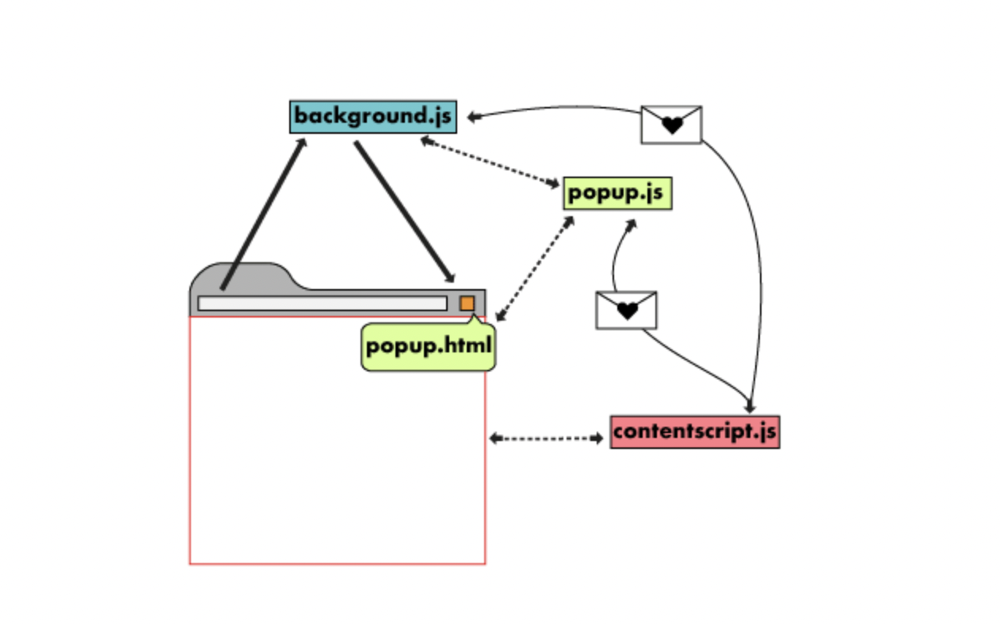
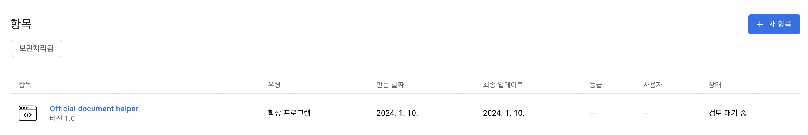

## 유용한 브라우저 익스텐션 개발하기
~~~
우아콘 2023을 보며 나와 동료들 모두에게 편한 도구를 제공하는 방법을 엿볼 수 있었다.
나도 나중에는 동료들에게 도움이되는 익스텐션을 개발해볼 수 있지 않을까 해서,
나에게 필요한 리액트 공식문서에서 코드를 크게 볼 수 있는 익스텐션을 개발해보려고 한다!

(한 번 해보면 다음엔 뚝딱 만들 수 있겠지 - _-+)
https://www.youtube.com/watch?v=YtrIAqgSDp8
~~~

## 크롬 브라우저 익스텐션의 구성
~~~
manifest
 ㄴ 설정 파일
background
 ㄴ 브라우저 영역에서 이벤트 헨들러가 포함된 스크립트
popup(UI)
 ㄴ HTML과 직접 상호작용하고, background 스크립트와 함께 API를 호출 (index.html과 같은 의미)
contentscript(나는 사용 안함)
 ㄴ 사용자 영역에서 웹(DOM)을 읽거나 쓰는 기능
Option page(나는 사용 안함)
 ㄴ 사용자 지정
~~~

## 시작하기
~~~
샘플코드를 가져왔다

https://github.com/yscho03/sample_chrome_extension

그리고 내 저장소에 레포를 만들었다.
https://github.com/KoGaYoung/official_document_helper
~~~

# manifest 파일 설정 변경 
~~~
https://developer.chrome.com/docs/extensions/mv3/manifest/

공식 문서를 보고 필요없는 기능을 삭제했다.
~~~

~~~
html에 간단하게 DOM 조작 문서를 넣었다.
리액트 공식문서의 왼쪽 오른쪽 사이드바의 display:none 속성을 추가하고,
메인 컨텐츠에는 gird 속성을 주었다.(부트스트랩으로 만들어진것 같은 className에 고전했다..)

on/off 는 체크박스로 간단하게 구현했다.
~~~

## 브라우저 익스텐션 제출
~~~
크롬 웹스토어 (https://chromewebstore.google.com/) 접속
-> 개발자 대시보드
-> 브라우저 익스텐션 등록 5달러 결제(1회)
-> 압축파일 업로드
-> 설명, 이미지, 스크린샷 첨부 후 업로드
~~~

등록완료!
