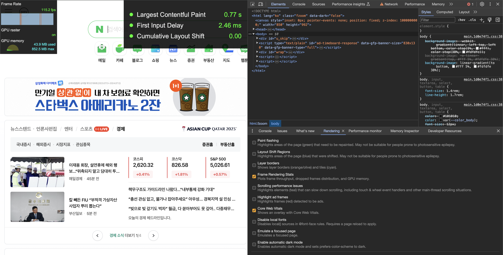

# [개발자도구 팁](https://developer.chrome.com/docs/devtools/tips?hl=ko)
---
# 개발자도구
~~~
개발자 도구를 잘 쓰면 개발할 때 도움이 많~~이 됩니다. (특히 디버깅할때요)
몰랐던 기능들도 이번기회에 정리를 해보려고합니다

1. Elements (dom, css, 디버깅, 이벤트 추적)
2. console (디버깅)
3. sources 
4. Performance insight
5. network (통신)
6. Performance (성능)
7. Memory (메모리 누수)
8. Application (스토리지)
9. Lighthouse 
10. Recorder
11. Settings
~~~

## 0.1 검사도구

~~~
이 친구를 클릭하고 (아래처럼 파란색으로 활성화 됨) 화면 내 요소를 선택하면
Elements 탭을 활성화하며 요소의 위치를 찾아주고, Style을 표시해줍니다.
~~~

## 0.2 디바이스 모드 확인

  
  

~~~
PC환경에서 모바일 뷰에서 어떻게 보일지 확인할 때 유용합니다.
추가로 확인하고 싶은 기기가 있다면
Edit -> Devices -> 추가 or Add Custom deivices를 통해 확인하고 싶은 기기의 Width * height를 입력
~~~

## 6. Performance (성능)
~~~
성능분석 페이지는 특정 구간을 녹화하여 그 구간을 분석하는 식으로 진행합니다. 초기렌더링을 확인하기 위해 아래 동그라미을 누르고 3~5초 뒤 stop을 누릅니다.
조금 기다리다보면 아래와 같은 화면을 얻을 수 있습니다.
~~~

### 자세히 알아보자

### 타임라인 영역

~~~
전체 페이지 로딩과 인터렉션에 대한 타임라인을 보여줍니다.
색상별로 네트워크 활동, 스크립팅, 렌더링 등의 다양한 작업을 구분합니다 (아래 summary 영역 색상과 같습니다)

빨간색: 긴 자바스크립트 작업, 높은 메인스레드 활동, 오류 등 성능 개선의 지표가 되는 경우가 많습니다 ( 'Long Tasks'  50ms가 넘는 경우 )
회색: 작업이 실행되지 않는 시간을 의미(리소스 로딩 완료 전 대기시간, cpu 유휴시간)
노란색: 노란색: 자바스크립트 실행시간
보라색: 스타일 계산과 레이아웃을 나타냄
녹색: 이지의 페인트 작업과 픽셀 렌더링
파란색: 네트워크활동, 리소스 로딩시간 등
~~~

### 빨간색을 확대해서 봅시다 (네트워크 영역, 자바스크립트 및 렌더링 영역)

~~~
네트워크 영역: 페이지가 로드되는 동안 발생한 네트워크 활동을 세부적으로 보여줍니다.
자바스크립트 및 렌더링 영역: 메인 스레드의 작업, 즉 자바스크립트 실행, 스타일 계산, 레이아웃, 페인트 등과 같은 다양한 작업을 세부적으로 보여줍니다.

[병목현상 확인하기]
이 영역들을 보면 어떤 작업에서 얼마나 걸렸는지 자세하게 알 수 있고 특히 개발환경에서보면 정확한 소스가 어느영역인지도 알 수 있다!
네트워크 영역에서는 오래걸리는 api를 확인할 수 있다.

아래 사진을 보면 해당 코드로 직접 넘어갈 수도 있다
~~~

~~~
보라색으로 표시된 부분은 내가 만든 컴포넌트이며,
1. Total Time과 Self Time을 비교하여 컴포넌트 자체의 연산이 시간을 많이 소비하는지, 아니면 자식 컴포넌트로 인해 시간이 소비되는지를 확인
2. 콜스택확인: 호출 스택을 살펴보고, 비효율적인 함수 호출이나 불필요한 계산이 있는지 검토 (콜스택을 따라가다보면 내가 개발한 컴포넌트를 찾을 수 있다)

오래걸린 부분을 개선하고 다시 속도를 측정해서 비교한다
~~~

~~~
DCL(DOMContentLoaded Event): DOM이 준비되고 그 시점에 자바스크립트 실행을 차단하는 스타일시트가 없는 시점을 표시.
 즉, 이제 (잠재적으로) 렌더링 트리를 생성 가능하다. DCL이 더 빠를수록 다음 로직이 더 빠르게 실행된다.
LCP(Largest Contentful Paint) : 가장 사이즈가 큰 컨텐츠가 렌더링 되는 시간을 나타냄(img, svg, video, url(). text nodes) 
 사이즈는 용량이 아닌 viewport에 보여지는 고유 너비, 높이로 판단한다. (좋은 사용 경험을 제공하기 위해서는 페이지가 처음으로 로딩된 후 2.5초 이내에 LCP 가 발생해야함)
FP(First Paint) : 첫 픽셀이 그려지는 시점
FCP(First Contentful Paint) : 페이지가 로딩을 시작해서 어떤 콘텐츠(텍스트, 이미지, svg, canvas, 등)가 화면에 보이기 시작할 때를 가리킴
L(Onload Event)

이런 타이밍을 보고 로드시점 혹은 로드이후 이벤트시점의 이벤트인지 찾는데 지표로 쓸 수 있다
~~~

~~~
실시간, 지속적으로 performance monitor로 시각적으로 바로 확인이 가능하다
(evnetListner를 보고 리스너 초기화 안되서 메모리 릭 나는지 확인 가능하다.)
~~~

~~~
react dev tool의 Components를 통해 불필요한 데이터가 있는지 컴포넌트 단위별러도 확인할 수 있다
~~~

~~~
하단 Rendering > Frame rendering stats
Rendering > core web vital을 통해 퍼포먼스탭보다
LCP랑 프레임율 사용 간단하게 보기 좋다.
~~~

