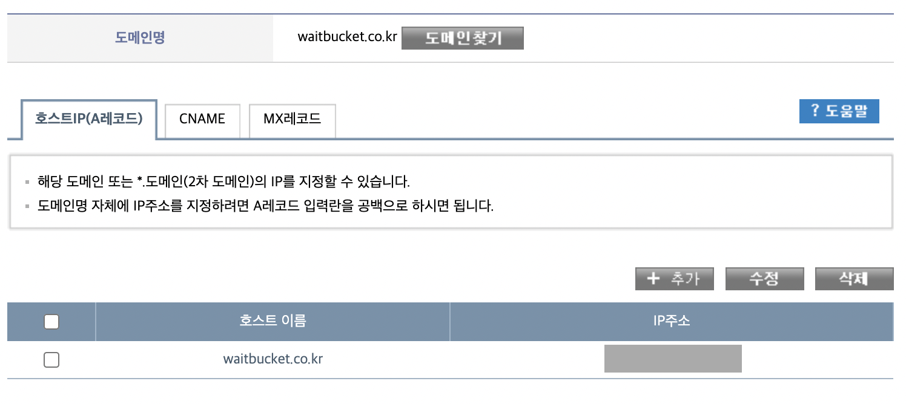
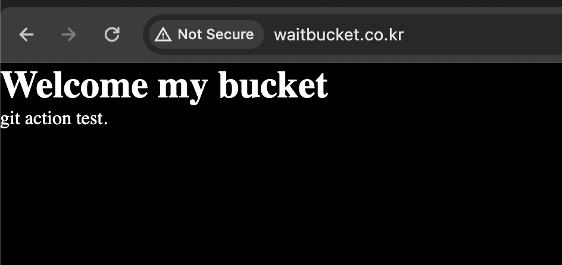

```
서비스를 배포하고싶지만 배포를 (내가) 하고싶진 않았다..TT
// 프론트앤드만 하고싶어..하지만 그럴 수 없음을 체념하기로 했다.
이 글은 개발만 좋아하는 AWS 문외환이 읽고 서비스를 배포할 때 참고하면 좋은글이다!

무료 서버 2대를 제공하는 오라클 클라우드 프리티어에 회원가입의 실패로 AWS를 활용했다.
나는 JS에 익숙하기 때문에 Node.JS(express) + FrontEnd 로 개발할 계획이다.
모든 단계를 요약하면 아래와 같다.
```

## Step
~~~
1. AWS 계정 생성
2. EC2 인스턴스 생성
3. 보안 그룹 설정
4. IAM 설정
5. SSH 접속해서 BackEnd, FrontEnd 서버 배포
6. 깃액션 연동 (생략 가능 하지만 강력추천)
7. DNS 등록
8. NginX 설정
~~~

## 완성된 나의 서비스 화면
// img 추가 예정

---

###  1. AWS 계정 생성
~~~
자 계정을 생성했다면 (축하해요!) 로그인 후 EC2 생성하기를 눌러줍니다.
~~~


### 2. EC2 인스턴스 생성
~~~
프론트앤드, 백앤드 서버를 아마존 클라우드에 배포하기 위해서는 EC2 인스턴스를 생성해야해요.
EC2는 Elastic Compute Cloud 의 줄임말로, 
말 그대로 아마존에서 제공하는 클라우드에요.

몇 가지 설정이 필요한데 차례대로 따라가봅시다. (각 설정별 설명도 해드릴께요)
~~~


~~~
이름을 입력해줍니다. (ex. wait_bucket)

서비스의 구조, 트래픽, 성능 요구사항 등 필요에 따라 인스턴스 갯수를 늘려줘야해요.
저의 경우에는 트래픽이 많은 서비스는 아니라고 생각해서
wait_bucket EC2 단일 인스턴스에 프론트앤드, 백앤드를 둘 다 배포하려고해요. 

단일 인스턴스: 비용 저렴, 관리포인트 감소
보통의 서비스에서는 DB인스턴스, 백앤드 인스턴스, 프론트앤드 인스턴스로 분리해서 관리합니다.
(보안과 확장에 용이해요, 단점은 비용과 관리포인트)

AMI (아마존 머신 이미지) 선택
AMI는 EC2 인스턴스를 생성하기 위한 초기설정 모음들입니다.
종류는 AWS Linux, 리눅스, 우분투 등이 있어요.
 - AWS Linux: 리눅스 기반 운영체재. 보안과 성능이 AWS에 최적화 되어있음
 - macOS: 애플 운영체제, Mac 전용 서비스인 경우 사용
 - 리눅스: 리눅스 운영체제. 

저의 경우에는 백앤드, 프론트앤드를 둘 다 하나의 인스턴스에 올릴것이기 때문에 
AWS Linux와 리눅스 둘 중 하나를 고민했는데요.
일단 리눅스는 조금이나마 접해봐서 좀 더 익숙하고, 소프트웨어 호환성이 높기때문에 (둘 다 배포하니까요..)

리눅스를 선택했습니다.
~~~


~~~
프리티어(무료)를 이용하고 있기 때문에 인스턴스 유형은 t2.micro를 선택해줍니다.
~~~


~~~
키-페어를 선택하거나 새로 만들어줍니다. 
만들어진 파일은 잘 저장해주세요. (중요해요!)
또한 파일은 보안상 외부에 노출되어서는 안됩니다.
이후 ssh 서버 접속, 깃 액션 연동에 (파일 내용이) 활용됩니다!

키-페어 이름은 아무거나 상관없습니다.
RSA 암호화를 선택해주고 파일은 ssh를 통해 접속할꺼기때문에 .pem 확장자로 선택합니다.

그리고 파일을 읽기전용으로 변경해줍니다.
chmod 400 /path/to/${your-key-name}.pem
~~~


~~~
네트워크 설정의 경우 기존 보안 그룹이 있다면 선택,
없다면 사진과 같은 기본설정으로 만들어줍니다.
(밑에서 보안그룹 만들꺼라 지금은 패스해요!)
~~~


~~~
스토리지의 용량을 30기가 내에서 설정할 수 있습니다.
저는 처음에 잘 몰라서 8기가로 설정했는데요.. 
이후에 서버에서 빌드, 배포하면서 CPU 100치고 서버가 힘들어하더라구요.....TT
16기가를 추천합니다.
(용량이 커지면 나중에 유료로 전환할 경우 더 많은 요금이 나옵니다.)

그리고 인스턴스 시작을 눌러주면 인스턴스 생성 완료입니다
~~~


## 3. 보안 그룹 설정
~~~
이번엔 보안그룹 페이지로 넘어와요.
아까 기본 설정으로 만들어둔 default 보안 그룹이 보입니다.
하지만 저는 default보다 예쁜 이름으로 보안그룹을 만들고 싶어서 (ㅋㅋㅋ중요합니다) 
launch-wizard-1 이름으로 하나 생성해주었습니다.
~~~


~~~
SSH(22번 포트), HTTP(80번 포트), HTTPS(443번 포트)에 대한 규칙을 설정해요.

네트워크 트래픽 흐름을 제어하는 규칙인 인바운드, 아웃바운드 규칙을 설정합니다.
인바운드: 외부에서 내부로 들어오는 트래픽 관리 
(= 인터넷에서 서버로 접근하는 요청을 제어)
아웃바운드: 네트워크에서 외부로 나가는 트래픽을 관리 
(= 서버가 인터넷의 다른 서버에 데이터를 보내거나 요청을 하는 경우 이를 제어)

SSH -> 우리가 서버에 접속해서 명령어를 실행하기 위한 포트입니다.
HTTP, HTTPS -> 웹 페이지를 요청하고 전송하는 데 사용해요
사용자 지정 TCP -> 서버(ex. 8000번 포트) 프론트(ex. 3000번 포트)에 띄우기 위함입니다.

보안그룹 생성을 눌러서 그룹을 생성해줘요!
~~~


~~~
그리고 EC2 > 작업 > 보안 > 보안그룹 설정으로 와서 보안그룹을 만들어둔 launch_wizard-1로 변경해줍니다.
~~~


---

## 4. IAM 설정
~~~
가 필요하다고 해서 했는데.. 
글을 작성하며 찬찬히 돌아보니 우리는 우리가 계정 만들어서 배포할꺼라(=root 사용자라) 필요가 없었어요
패스합니다.
~~~

---

## 5. SSH 접속해서 BackEnd, FrontEnd 서버 배포


~~~
터미널에서 다음 명령어를 사용하여 인스턴스에 접속해요.
ssh -i /path/to/${your-key-name}.pem {AMI}@${your-instance-public-dns}

저의 경우에는 bucketServerTest 라는 이름으로 키 이름을 만들었고,
AMI는 ubuntu를 사용헀고, 인스턴스의 public dns를 복사해서 명령어를 만들어줬어요.
~~~


### 5. 1 인스턴스 서버에 Node.js와 NPM을 설치해주세요.
~~~
curl -sL https://deb.nodesource.com/setup_14.x | sudo -E bash -
sudo apt-get install -y nodejs
~~~
### 5. 2 인스턴스 서버에 Git을 설치합니다.
~~~
sudo apt-get update
sudo apt-get install git
~~~

### 5. 3 프로젝트 클론해줘요
~~~
git clone [백엔드 레포지토리 URL] [백앤드 폴더명]
git clone [프론트엔드 레포지토리 URL] [프론트 폴더명]
~~~

### 여기서 ls를 통해 확인해보면 두 프로젝트가 클론된 것을 확인할 수 있습니다.


### 5. 4 종속성 설치도 해주세요
~~~
cd wait_bucket_server
npm install
cd ../wait_bucket
npm install
~~~


### 5. 5 서버 실행
~~~
# 백엔드
pm2 start {app.js} --name {wait_bucket_server}

# 프론트엔드
npm run build
pm2 start npm -w --name {wait_bucket} -- run start
~~~

### 5. 6 서버 확인
~~~
pm2 status
~~~


### 브라우저를 통해서도 확인이 가능해요
~~~
퍼블릭 IPv4 DNS:{port}
를 통해 접속해서 화면을 확인할 수 있어요.
~~~


### 스크립트로 배포를 자동화해볼까요?
(코드 변경할 때마다 스크립트로 명령어들을 한번에 처리해줘요)

~~~
# 백엔드
vi start_backend.sh 

# 내용은 아래와 같이 구성하고 esc + :wq!(저장!)
cd wait_bucket_server
git pull origin main

rm -rf ./node_modules
npm install

pm2 reload wait_bucket_server

#pm2 start app.js --name wait_bucket_server # discription: first launch


# 프론트엔드
vi start_frontend.sh 

# 내용은 아래와 같이 구성하고 esc + :wq!(저장)
cd ./wait_bucket
git pull origin main
# rm -rf ./node_modules
npm install
npm run build
pm2 reload wait_bucket

# pm2 start npm -w --name wait_bucket -- run start

# 실행권한 부여
chmod +x ./wait_bucket/start_backend.sh
chmod +x ./wait_bucket/start_frontend.sh

# 실행명령어
./start_backend.sh 
./start_frontend.sh 
~~~

~~~
실행 명령어를 실행시켜보면 아까 처음 설치할 때처럼 빌드 -> 배포가 실행돼요

뭔가 이상하다싶으면
pm2 delete all 후 재 실행해주세요
~~~

---

### 6. 깃액션 연동 (생략 가능 하지만 강력추천)
(매번 SSH서버에 접속해서 배포해주기도 귀찮은 당신! 
하지만 젠킨스를 서버에 띄우기는 귀찮은 당신! = 사실 접니다^^;)

### 6 . 1 (백앤드) 필요한 키부터 넣어줍시다
~~~
레포지토리 > Settings > Secrect and variables > Actions > new respository secrect
~~~


~~~
SSH_PEM, BUILD_SSH_IP, BUILD_SSH_USER 키를 만들어줍니다. (일단 따라해봐요 이유가 있어요)
(pem파일은 파일 내용이 필요한데, .pem 파일은 open with -> textEdit 같은 편집기로 열어서 내용을 복붙해주세요)
~~~


~~~
SSH_PEM, BUILD_SSH_IP, BUILD_SSH_USER 키를 만들어줍니다. (일단 따라해봐요 이유가 있어요)
아래 사진은 만들어진 예쁜 키들..
~~~


~~~
그리고 git action에서 ec2를 통한 배포를 눌러줍니다
그러면 ./github/workflows 내 파일 편집기가 열립니다.
(파일명 main으로 바꿔주세요.)
~~~


~~~
그리고 아래 코드를 넣고 commit을 해볼까요
~~~

~~~
name: CI
on:
  push:
    branches: [ "main" ]

jobs:
  deploy:
    runs-on: ubuntu-latest
    steps:
      # GitHub 리포지토리를 체크아웃
      - name: Checkout Repository
        uses: actions/checkout@v3

      # Node.js를 설정합니다. 저는 버전 18을 사용합니다.
      - name: Set up Node.js
        uses: actions/setup-node@v3
        with:
          node-version: "18"

      # SSH 접속 키 파일을 저장해줍니다.
      - name: Register SSH Host Key
        run: |
          mkdir -p ~/.ssh
          ssh-keyscan -p ${{ secrets.BUILD_SSH_PORT }} -H ${{ secrets.BUILD_SSH_IP }} 2>&1 | tee -a ~/.ssh/known_hosts

      # 원격 서버에 SSH로 접근하여 배포 작업을 수행합니다. 
      - name: Deploy to Server
        env:
          DEPLOY_SSH_KEY: ${{ secrets.SSH_PEM }}
          BUILD_SSH_IP: ${{ secrets.BUILD_SSH_IP }}
          BUILD_SSH_USER: ${{ secrets.BUILD_SSH_USER }}
        run: |
          # SSH 키 설정을 수행합니다.
          mkdir -p ~/.ssh
          echo "$DEPLOY_SSH_KEY" > ~/.ssh/id_rsa
          chmod 600 ~/.ssh/id_rsa

          # 빌드 서버에 SSH로 접근하여 배포 스크립트를 실행합니다.
          # 여기서는 사용자 정의 스크립트 './start_backend.sh'를 실행합니다.
          ssh -i ~/.ssh/id_rsa $BUILD_SSH_USER@$BUILD_SSH_IP "./start_backend.sh"
~~~

~~~
그리고 git action에 들어가보면! 아래처럼 빌드가 도네요.
성공하면 이제 코드푸시 배포자동화가 완성된 겁니다(만세 ^.ㅠ)

오류가 난다면 로그를 보고 수정을해주세요.
~~~


~~~
프론트앤드 레포에서도 동일하게 키를 추가해주고, 아래 코드를 추가해주세요.
~~~

~~~
name: CI

on:
  push:
    branches:
      - main

jobs:
  build:
    runs-on: ubuntu-latest

    steps:
      - name: Checkout Repository
        uses: actions/checkout@v3

      - name: Set up Node.js
        uses: actions/setup-node@v3
        with:
          node-version: "18"

      - name: Register SSH Host Key
        run: |
          mkdir -p ~/.ssh
          ssh-keyscan -p ${{ secrets.BUILD_SSH_PORT }} -H ${{ secrets.BUILD_SSH_IP }} 2>&1 | tee -a ~/.ssh/known_hosts

      - name: Build on Build Server
        env:
          DEPLOY_SSH_KEY: ${{ secrets.SSH_PEM }}
          BUILD_SSH_IP: ${{ secrets.BUILD_SSH_IP }}
          BUILD_SSH_USER: ${{ secrets.BUILD_SSH_USER }}
        run: |
          # SSH 키 설정
          mkdir -p ~/.ssh
          echo "$DEPLOY_SSH_KEY" > ~/.ssh/id_rsa
          chmod 600 ~/.ssh/id_rsa
          # 빌드 서버에 SSH 접근하여 빌드 명령 실행
          ssh -v -i ~/.ssh/id_rsa $BUILD_SSH_USER@$BUILD_SSH_IP "./start_frontend.sh"

~~~

###  7. DNS 등록

~~~
DNS는 말그대로 저희가 브라우저상에 google.com을 치면
구글 서버로부터 화면을 받아오는데요. DNS는 google.com이란 도메인명 가지고 ip주소를 매핑해주는 역할을해요.

그럼 사용자들도 저의 도메인명 가지고 저의 서버에 접속하기위해서는 DNS를 등록해줘아해요
모든 도메인 업체는 연결되어있어서 아무사이트에서나 등록해도됩니다.

저의 경우에는 반값도메인에서 waitbucket.co.kr 도메인을 구매했습니다.
도메인 이름을 IP주소로 변환하는데 사용하는 A레코드를 등록해주었습니다.
~~~



~~~
자 여기서 waitbucket.co.kr로 접속할 경우 화면이 안뜹니다
이유는 아까 Front의 포트를 3000으로 지정했기 때문인데요
(next의 경우 기본적으로 3000포트를 사용합니다.)

포트는 DNS상에서 설정할 수 없어서 
이걸 NginX라는 웹 서버를 통해서 
프론트엔드 서버가 80(HTTP) 또는 443(HTTPS) 포트를 사용하도록 웹 서버 설정을 조정해야 해요
~~~

###  8. NginX 설정

~~~
EC2 인스턴스 서버에 접속해서 아래 명령어들을 실행해줍니다

# Nginx 설치
sudo apt-get update && sudo apt-get install nginx

# Nginx 실행중인지 확인
sudo systemctl status nginx

# 설정파일 생성
sudo nano /etc/nginx/sites-available/{waitbucket}

# 아래 코드 넣어줘요 {} <- 부분은 수정이 필요해요
server {
    listen 80;
    server_name {waitbucket.co.kr};

    location / {
        proxy_pass http://{IPv4 DNS}:3000;
        proxy_http_version 1.1;
        proxy_set_header Upgrade $http_upgrade;
        proxy_set_header Connection 'upgrade';
        proxy_set_header Host $host;
        proxy_cache_bypass $http_upgrade;
    }
}

# 설정 파일을 sites-enabled 디렉토리에 링크합니다: 
sudo ln -s /etc/nginx/sites-available/waitbucket /etc/nginx/sites-enabled/

# Nginx 구성을 테스트
sudo nginx -t

# Nginx 재시작
sudo systemctl restart nginx
~~~
~~~
하면 짠!!! 
이제 feature 브랜치 하나 만들어서 신나게 개발한 후에 main 브랜치로 푸시만하면, 자동으로 배포되는 저의 사이트를 완성했습니다
이글을 읽으신 분도 접속해보세요

http://waitbucket.co.kr/
~~~


